@[TOC](导航)

---
**本项目已开源至GitHub：*[点我传送](https://github.com/firestaradmin/HouseKeeperV1)***

---
# 一、HouseKeeperV1.0介绍
### 1.项目简介：

 - HouseKeeper_V1.0  是一款智能物联家居产品，它可以根据需求方便的扩展各种家居家电控制，例如门的控制，窗帘的控制，和一些其他家电的控制，只需要简单外接一个继电器便可。本次我们将用指纹门锁控制，来阐述HouseKeeper的功能。
### 2.项目图片外观实例：
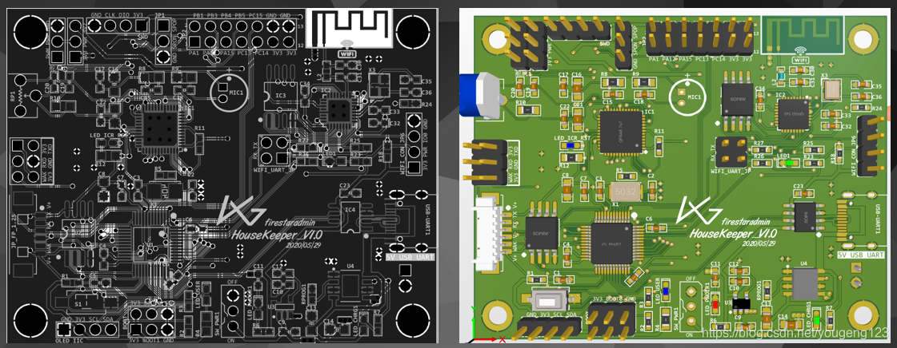
##### · 初步产品图如下
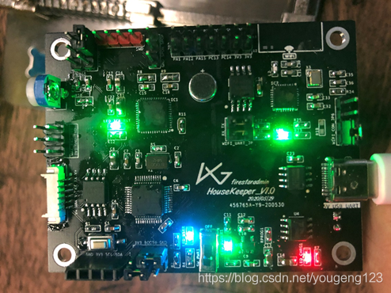
##### · 指纹门锁实例图
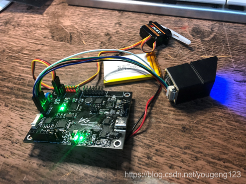
### 3.项目板载资源及功能介绍：
 - 本次项目PCB使用STM32F103C8T6作为主控芯片，板载了WIFI和LD3320语音识别芯片。 有板载麦克风，和0.5W的扬声器输出。
   PCB周边具有舵机接口，指纹模块接口，和将近十个IO扩展，可方便的扩展其他应用。
   另外Type-C的usb串口供电二合一，很方便产品开发阶段使用。

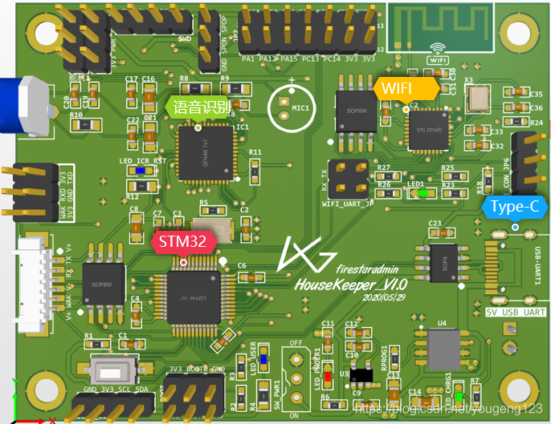

 - 板载资源：
MCU：STM32F103
SPI-FLASH：	W25Q64-8MB
WIFI：ESP8266EX
语音识别： LD3320
锂电池电源管理：TP4056
等等

# 二、HouseKeeperV1.0部分原理图
### 1.主控部分：
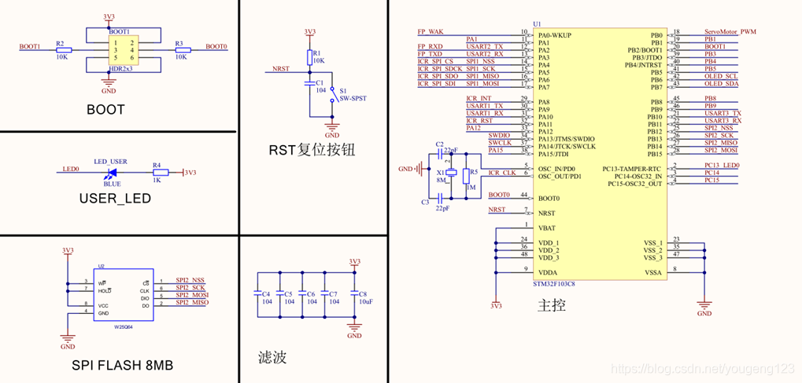
### 2.ESP8266EX-WIFI部分：
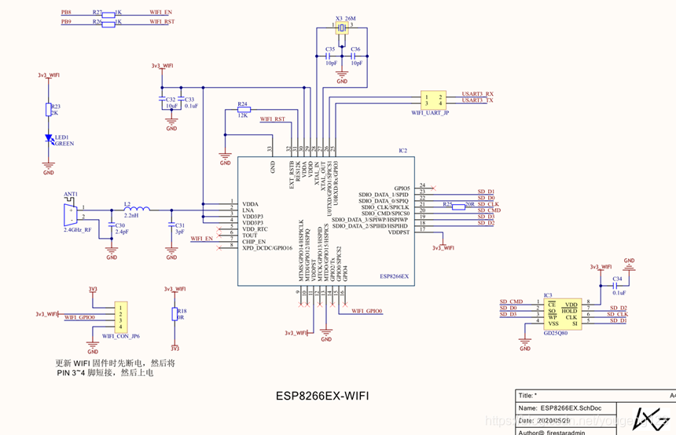
### 3.LD3320语音识别部分：
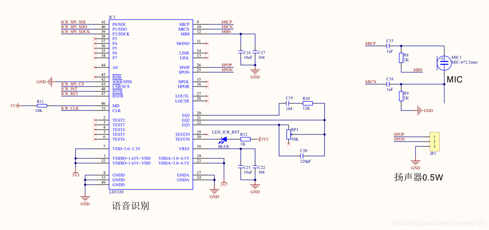
# 三、基于HouseKeeperV1.0的案例-物联网指纹门锁

 - 程序会识别指纹id，判断是谁开了门，并且实时更新到云服务器上的数据库中。 QT中可以实时查看到服务器数据库的信息。

### 1.基础流程图：
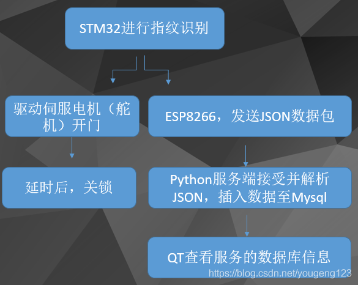
### 2.软件部分框架：
 - 主控程序使用keil编写STM32—C程序
 - WIFI固件，采用arduino编写C++程序
 - 服务器后台使用Python编写SOCKET TCP服务程序
 - 服务器部署了Mysql数据库用于记录开门信息
 - 上位机查看数据库使用QT-C++编写
##### 1.ESP8266WIFI固件功能：
 - 首先连接指定WIFI，循环检查连接状态 如果接受到了，主控发送来的指纹ID，说明该ID开了门 
 - 使用socket连接服务器Serve端。 发送指定格式的JSON数据包，根据ID识别是某位开的门，上传不同的信息

 - **JSON数据包格式：”{“opreation”:“close”, “Note”:“firestaradmin”}”**
##### 2.Python服务端功能：

 - 使用socket 建立TCP服务器，等待Client的连接。
 - 如果有数据接收到，就进行JSON解析，如果正确，无缺失内容，则和系统时间，一起插入至Mysql数据库。
 - 接受客户端发送JSON数据包并解析，解析成功后讲数据插入Mysql数据库

### 3.实例开发过程的一些图片：
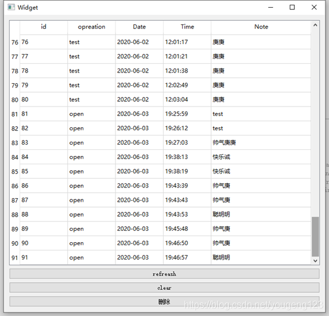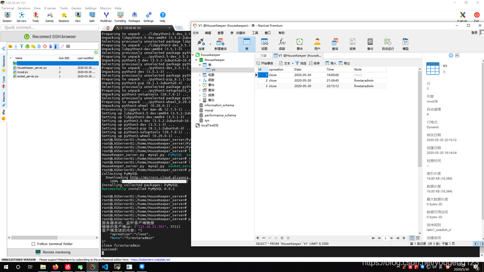

 - 具体演示视频已上传至GitHub项目文件下的report文件夹下，可一起下载后观看

# 四、制作过程部分图片
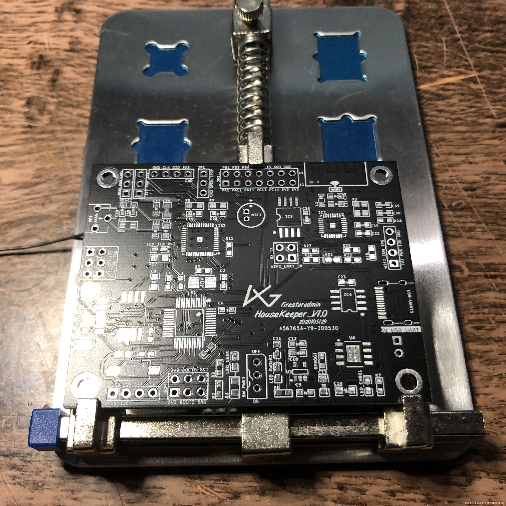

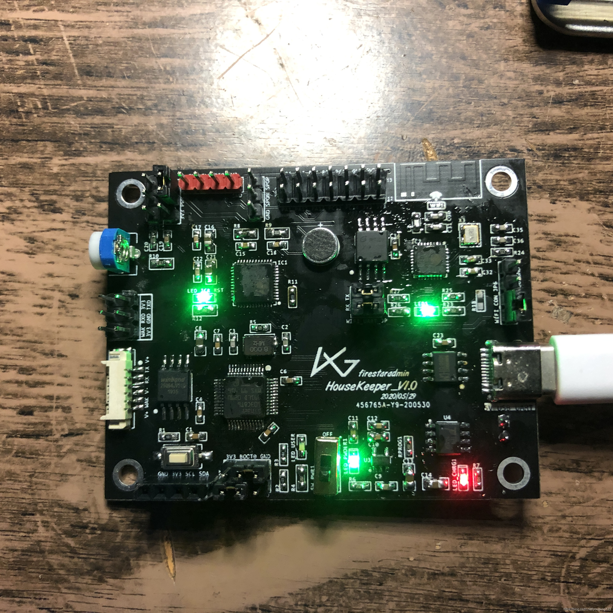

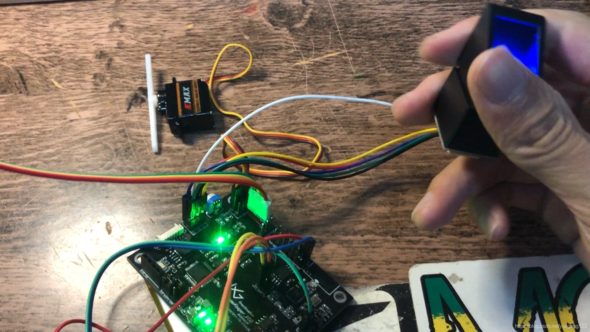
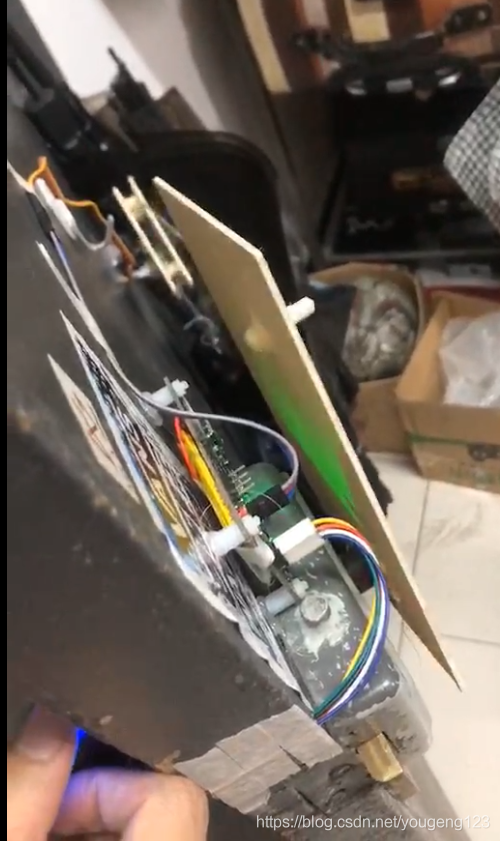